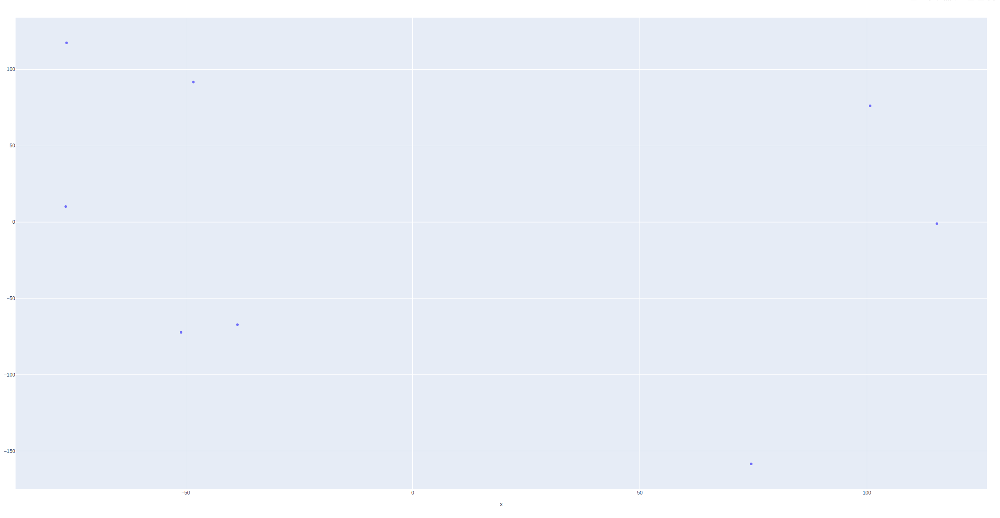
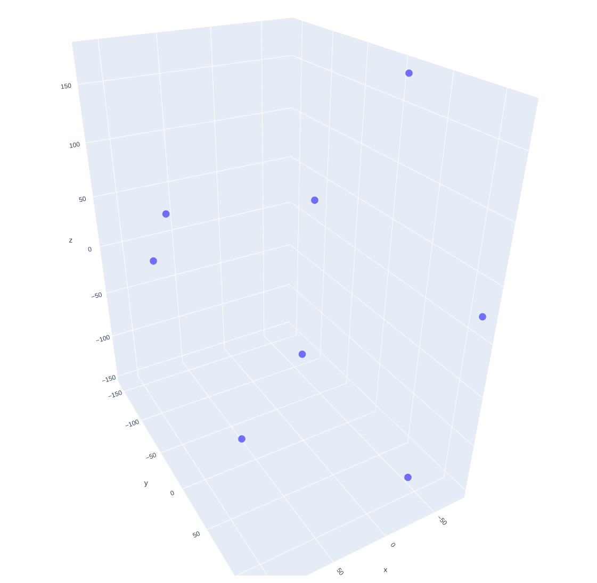
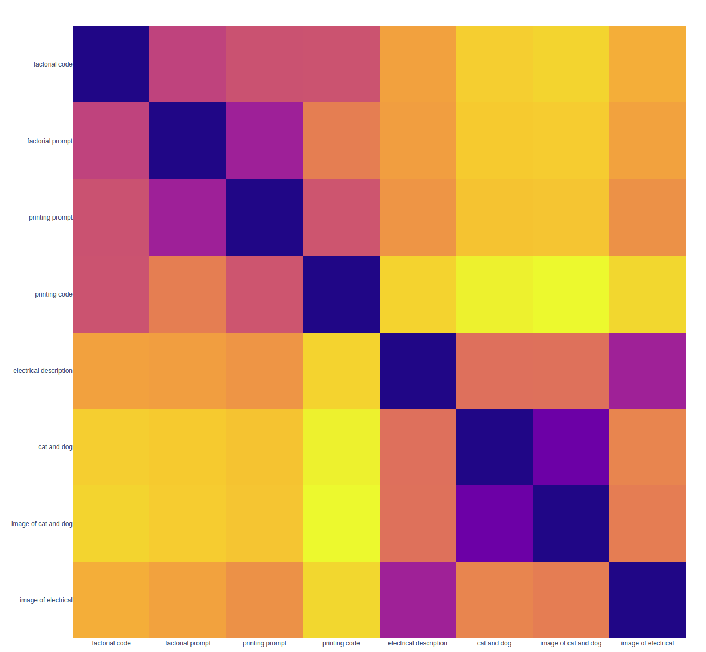

# shared-embedding

A shared embedding for code images and text, powered by https://text-generator.io

Example shows text descriptions and relevant code snippets are embedded together, similarly with images and descriptions of images


### Running
get an API key for https://text-generator.io (there is a free tier of 100 requests every month)

```
export TEXT_GENERATOR_SECRET=your_secret
virtualenv .env
. ./.env/bin/activate

pip install -r requiremments.txt
python embed_example.py
```

This will plot a few embedding examples in 2d and 3d with plotly/t-SNE

Checkout [embed_example.py](embed_example.py) for how it works.

Embedding size can be specified in the API with num_features

### 2d plot
Some data is preserved in the 2d embedding, it obscures that the images and their descriptions where successfully embedded close to one another (if you look at distance in the embedding space)

### 3d plot
everything is seperated further in 3d due to more dimensions



### Embedding distances Heatmap
This shows how close text is embedded to one another, the prompts and images are embedded close to one another (purple) space.

The descriptions of the images and the images themselves are close together!

